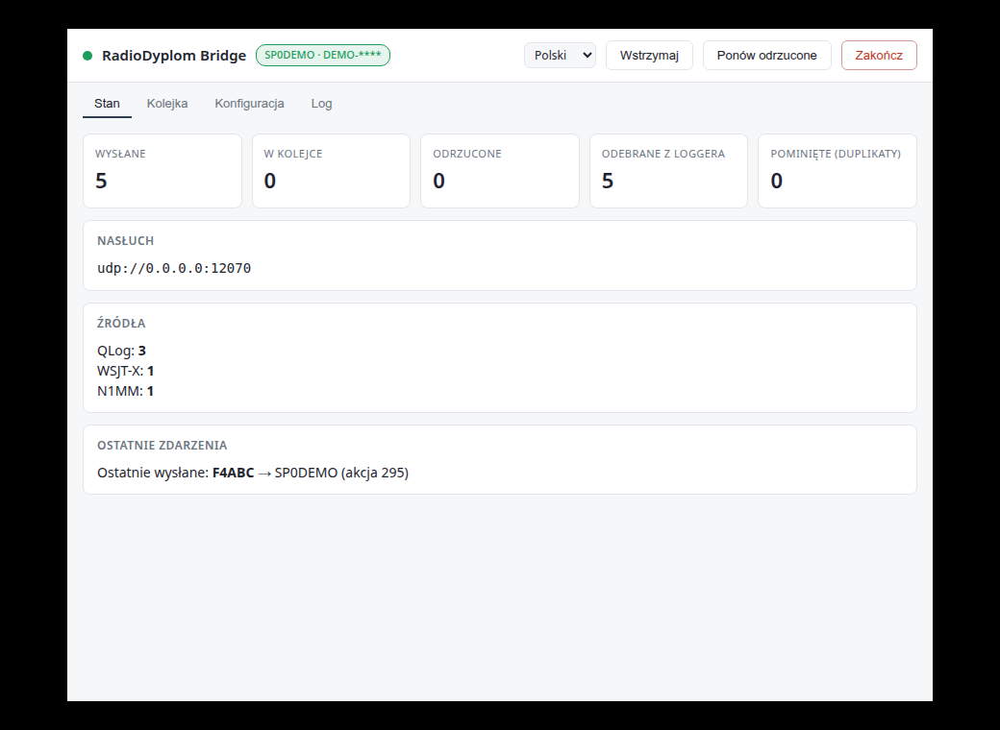

# RadioDyplom Bridge

**Zalogowałeś QSO w swoim loggerze — i już jest na radiodyplom.pl.**

Mostek nasłuchuje, co logger wysyła po UDP, i przekazuje każdą łączność na serwer
akcji dyplomowej. Bez eksportu ADIF, bez wgrywania plików, bez pamiętania o niczym.

[](https://github.com/SQ8BWM/radiodyplom-bridge/actions/workflows/testy.yml)



---

## Dlaczego warto

- **Trzy rodziny loggerów naraz** — format datagramu rozpoznawany automatycznie,
  jeden port obsługuje mieszane źródła.
- **Nic nie ginie przy zerwanej łączności.** QSO czekają w kolejce na dysku i idą
  same, gdy internet wróci. Kolejka przeżywa restart komputera.
- **Jedna łączność na kilka znaków stacji** — przydatne, gdy w akcji pracujesz
  pod więcej niż jednym znakiem.
- **Widać, co się dzieje.** Liczniki, kolejka, powody odrzuceń i log do pliku —
  zamiast zgadywania, czy coś doszło.
- **Sprawdza konfigurację wobec Twojego konta** — ostrzega o znaku stacji, którego
  serwis nie przyjmie, zanim pierwsze QSO wróci odrzucone.
- **Statystyki** — ile QSO w który dzień, na której akcji, spod której stacji,
  na jakim pasmie.
- **Tryb próbny**, żeby najpierw sprawdzić mapowanie pól, a dopiero potem wysyłać.

| Protokół | Loggery |
|---|---|
| JSON (Notifications) | **QLog** |
| XML `<contactinfo>` | **N1MM+**, DXLog, BBlogger, Log4OM (tryb N1MM) |
| binarny QDataStream | **WSJT-X**, JTDX ≥ 2.2.158, MSHV |

---

## Instalacja

Pobierz z **[wydań](https://github.com/sq8bwm/radiodyplom-bridge/releases)**:

| Plik | System |
|---|---|
| `radiodyplom-bridge-*-setup.exe` | Windows — instalator |
| `radiodyplom-bridge-*-portable.exe` | Windows — bez instalacji |
| `radiodyplom-bridge-*.AppImage` | Linux — uniwersalny |
| `radiodyplom-bridge-*.deb` | Debian / Ubuntu |

Na Linuksie `.deb` dodaje pozycję do menu (**Internet / Sieć**). AppImage niczego
nie instaluje — uruchamiasz plik i tyle, więc w menu się nie pojawi.

**Windows 10 lub nowszy** (64-bitowy). Na Windows 7 i 8 program się nie uruchomi —
system odmówi wczytania pliku komunikatem *„nie jest prawidłową aplikacją systemu
Win32"*. Nie da się tego obejść, ale mostek **nie musi stać na tym samym
komputerze co logger** — patrz [Windows i sieć](docs/windows-i-siec.md#windows-7-i-8--program-się-nie-uruchomi).

Instalatory **nie są podpisane certyfikatem**, więc Windows pokaże SmartScreen
(„Nieznany wydawca") — *Więcej informacji → Uruchom mimo to*. Do każdego wydania
dołączony jest plik sum kontrolnych:

```bash
sha256sum -c SHA256SUMS
```

---

## Konfiguracja w trzech krokach

**1. Weź PIN API.** W Managerze radiodyplom: *Dostęp API → Generuj nowy PIN API →
Zapisz PIN API*. PIN jest przypisany do Twojego profilu użytkownika.

**2. Wpisz go w programie**, zakładka **Konfiguracja**. Działa od razu, bez restartu.

**3. Ustaw logger, żeby wysyłał po UDP na `127.0.0.1:12060`:**

| Logger | Gdzie |
|---|---|
| QLog | *Settings → Network → Notifications → **QSO Changes*** |
| N1MM+ / DXLog | rozgłoszenie na porcie 12060 |
| WSJT-X / JTDX / MSHV | *Settings → Reporting → UDP Server* |

> **Logger na innym komputerze albo wysyła rozgłoszeniowo?**
> Zmień adres nasłuchu na `0.0.0.0` w zakładce Konfiguracja. To najczęstsza
> przyczyna „nie działa" — i jedyna z tych zmian, która wymaga restartu programu.

---

## Używanie

Zostaw **tryb próbny** włączony, zaloguj jedno QSO i zajrzyj w zakładkę **Log** —
zobaczysz dokładnie to, co poleciałoby na serwer. Gdy pola się zgadzają, wyłącz
tryb próbny i pracuj normalnie.

Program żyje **w zasobniku systemowym**. Zamknięcie okna go nie kończy — mostek
pracuje dalej. Do zakończenia służy przycisk **„Zakończ"** w oknie.

Kolor plakietki i ikony mówi wszystko bez otwierania okna:

| | |
|---|---|
| 🟢 | działa, łączność jest |
| 🔴 | brak łączności — QSO czekają i **zostaną dosłane same** |
| 🟡 | wstrzymane ręcznie albo są odrzucone QSO wymagające Twojej decyzji |

Interfejs jest po **polsku i angielsku**, przełącznik w nagłówku.

---

## Dokumentacja

| Dokument | O czym |
|---|---|
| [Loggery i dane](docs/loggery.md) | obsługiwane loggery, ich konfiguracja, mapowanie pól |
| [Konfiguracja](docs/konfiguracja.md) | wszystkie opcje, co działa od razu, katalogi danych |
| [Rozmnażanie QSO](docs/fan-out.md) | jedna łączność jako kilka wpisów |
| [Kolejka i log](docs/kolejka.md) | deduplikacja, ponawianie, zachowanie przy błędach |
| [Interfejs i API](docs/interfejs.md) | okno, zasobnik, lokalne API stanu |
| [Statystyki](docs/statystyki.md) | ile QSO, na której akcji, spod której stacji |
| [Windows i sieć](docs/windows-i-siec.md) | rozgłoszenia, multicast, zapora, autostart |
| [Rozwój](docs/rozwoj.md) | wymagania, testy, budowanie paczek |

Znane usterki i plany: [BACKLOG.md](BACKLOG.md).

---

## Tryb bez okna

Rdzeń działa też bez interfejsu — na Raspberry Pi w shacku albo jako usługa:

```bash
npm install
cp config.example.json config.json    # wstaw PIN
npm start
```

Node.js ≥ 18, zero zależności runtime.

---

Autor: **SQ8BWM** · licencja **GPL-3.0-or-later** ([pełny tekst](LICENSE))

To wolne oprogramowanie: możesz je rozpowszechniać i modyfikować na warunkach
Powszechnej Licencji Publicznej GNU w wersji 3 albo dowolnej późniejszej.
Program jest udostępniany **bez żadnej gwarancji**.
