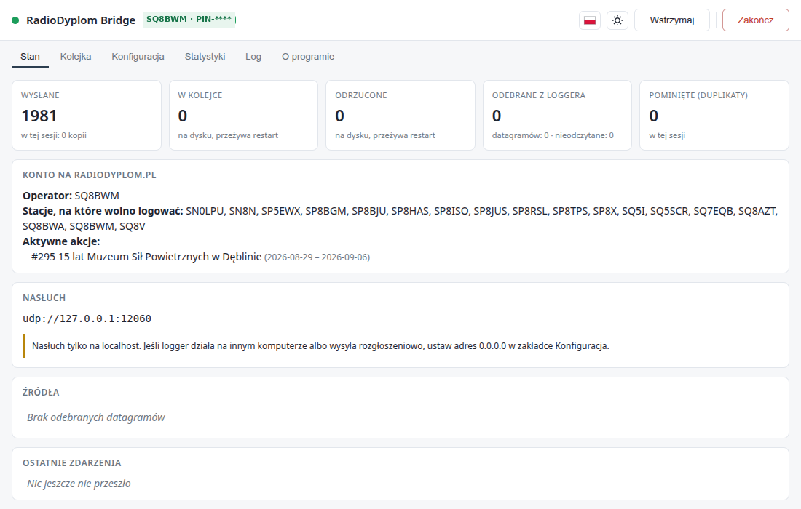
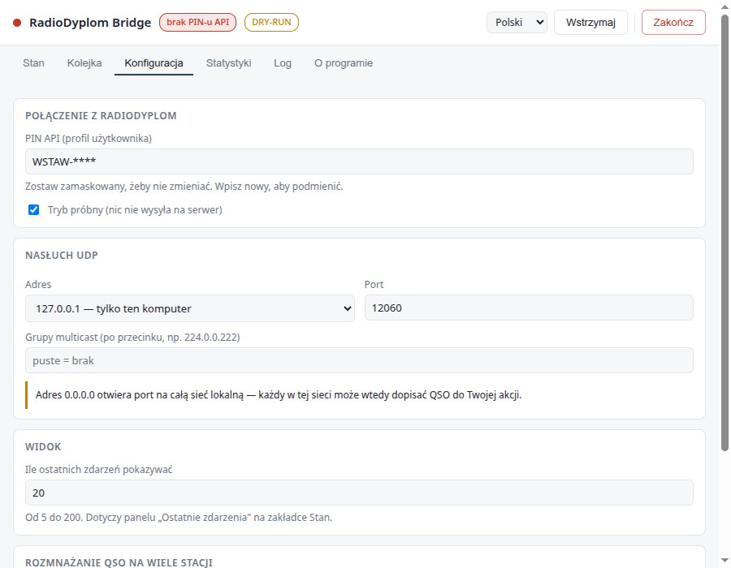
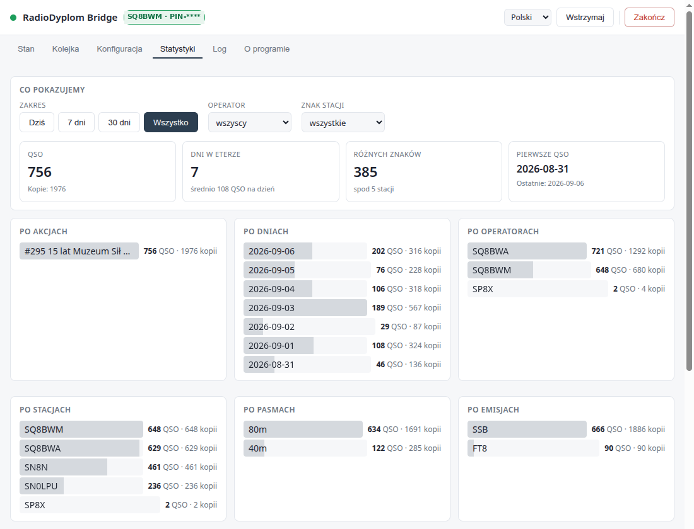

# RadioDyplom Bridge

**Zalogowałeś QSO w swoim loggerze — i już jest na radiodyplom.pl.**

[](https://github.com/SQ8BWM/radiodyplom-bridge/actions/workflows/testy.yml)

---

## Do czego to jest

W akcji dyplomowej łączności muszą trafić na serwer akcji, żeby policzyły się do
dyplomu — Twojego i tych, którzy Cię pracowali. Zwykle robi się to po sesji:
eksport ADIF z loggera, wejście na stronę, wgranie pliku. O ile się pamięta.

Ten program robi to **na bieżąco i bez Twojego udziału**. Stoi obok loggera,
odbiera datagramy, które ten i tak wysyła po UDP, i każde nowe QSO od razu
przekazuje do [radiodyplom.pl](https://radiodyplom.pl). Nie zmienia ustawień
loggera, nie dotyka Twojego dziennika, nie wymaga pamiętania o niczym.

**Dla kogo:** operator pracujący w akcji dyplomowej, który loguje w QLogu, N1MM+,
WSJT-X albo pokrewnym programie i ma konto na radiodyplom.pl.

**Czego nie robi:** nie jest loggerem — nie zastępuje Twojego programu i nie
prowadzi dziennika za Ciebie. Z serwera tylko pobiera listę Twoich stacji
i aktywnych akcji; niczego tam nie zmienia poza dopisaniem QSO.



---

## Dlaczego warto

- **Trzy rodziny loggerów naraz** — format datagramu rozpoznawany automatycznie,
  jeden port obsługuje mieszane źródła.
- **Nic nie ginie przy zerwanej łączności.** QSO czekają w kolejce na dysku i idą
  same, gdy internet wróci. Kolejka przeżywa restart komputera.
- **Jedna łączność na kilka znaków stacji** — przydatne, gdy w akcji pracujesz
  pod więcej niż jednym znakiem.
- **Widać, co się dzieje.** Liczniki, kolejka, powody pominięć i log do pliku —
  zamiast zgadywania, czy coś doszło.
- **Sprawdza konfigurację wobec Twojego konta** — ostrzega o znaku stacji, którego
  serwis nie przyjmie, zanim pierwsze QSO wróci odrzucone.
- **Statystyki** — ile QSO w który dzień, na której akcji, spod której stacji,
  na jakim pasmie.
- **Tryb próbny**, żeby najpierw sprawdzić mapowanie pól, a dopiero potem wysyłać.
- **Działa też bez pulpitu** — na Raspberry Pi jako usługa, z oknem w przeglądarce.

| Protokół | Loggery |
|---|---|
| JSON (Notifications) | **QLog** |
| XML `<contactinfo>` | **N1MM+**, DXLog, BBlogger, Log4OM (tryb N1MM) |
| binarny QDataStream | **WSJT-X**, JTDX ≥ 2.2.158, MSHV |

---

## Instalacja

Pobierz z **[wydań](https://github.com/sq8bwm/radiodyplom-bridge/releases)**:

| Plik | System |
|---|---|
| `radiodyplom-bridge-*-x64-setup.exe` | Windows 10+ — instalator |
| `radiodyplom-bridge-*-x64-portable.exe` | Windows 10+ — bez instalacji |
| `radiodyplom-bridge-*-x86_64.AppImage` | Linux — uniwersalny |
| `radiodyplom-bridge-*-amd64.deb` | Debian / Ubuntu |
| `radiodyplom-bridge-headless-*-all.deb` | **bez interfejsu** — Raspberry Pi, serwer ([opis](docs/malinka.md)) |

Wersje z interfejsem są **tylko 64-bitowe na procesory Intel/AMD** — stąd `x64`,
`amd64` i `x86_64` w nazwach (to samo, trzy konwencje). Paczka `headless` ma
`all`, bo to czysty JavaScript: działa też na **arm64 i armhf**, czyli na malince.

Na Linuksie `.deb` dodaje pozycję do menu (**Internet / Sieć**). AppImage niczego
nie instaluje — uruchamiasz plik i tyle, więc w menu się nie pojawi.

**Windows 10 lub nowszy** (64-bitowy). Na Windows 7 i 8 program się nie uruchomi —
system odmówi wczytania pliku komunikatem *„nie jest prawidłową aplikacją systemu
Win32"*. Nie da się tego obejść, ale mostek **nie musi stać na tym samym
komputerze co logger** — patrz [Windows i sieć](docs/windows-i-siec.md#windows-7-i-8--program-się-nie-uruchomi).

Instalatory **nie są podpisane certyfikatem**, więc Windows pokaże SmartScreen
(„Nieznany wydawca") — *Więcej informacji → Uruchom mimo to*. Do każdego wydania
dołączony jest plik sum kontrolnych:

```bash
sha256sum -c SHA256SUMS
```

---

## Konfiguracja w trzech krokach

Tak wygląda program zaraz po instalacji: **tryb próbny włączony**, PIN jeszcze
niewpisany, plakietka w nagłówku mówi wprost, czego brakuje.



**1. Weź PIN API.** W Managerze radiodyplom: *Dostęp API → Generuj nowy PIN API →
Zapisz PIN API*. PIN jest przypisany do Twojego profilu użytkownika.

**2. Wpisz go w programie**, zakładka **Konfiguracja**. Działa od razu, bez restartu.
Później pole pokazuje PIN **zamaskowany** (`ABCD-****`) — zostaw tak, żeby go nie
zmieniać. PIN nigdy nie opuszcza programu w jawnej postaci, także przez API stanu.

**3. Ustaw logger, żeby wysyłał po UDP na `127.0.0.1:12060`:**

| Logger | Gdzie |
|---|---|
| QLog | *Settings → Network → Notifications → **QSO Changes*** |
| N1MM+ / DXLog | rozgłoszenie na porcie 12060 |
| WSJT-X / JTDX / MSHV | *Settings → Reporting → UDP Server* |

> **Logger na innym komputerze albo wysyła rozgłoszeniowo?**
> Zmień adres nasłuchu na `0.0.0.0` w zakładce Konfiguracja. To najczęstsza
> przyczyna „nie działa" — i jedyna z tych zmian, która wymaga restartu programu.

---

## Używanie

Zostaw **tryb próbny** włączony, zaloguj jedno QSO i zajrzyj w zakładkę **Log** —
zobaczysz dokładnie to, co poleciałoby na serwer. Gdy pola się zgadzają, wyłącz
tryb próbny i pracuj normalnie.

Program żyje **w zasobniku systemowym**. Zamknięcie okna go nie kończy — mostek
pracuje dalej. Do zakończenia służy przycisk **„Zakończ"** w oknie.

Kolor plakietki i ikony mówi wszystko bez otwierania okna:

| | |
|---|---|
| 🟢 | działa, łączność jest |
| 🔴 | brak łączności — QSO czekają i **zostaną dosłane same** |
| 🟡 | wstrzymane ręcznie albo są odrzucone QSO wymagające Twojej decyzji |

Mostek **nie uruchamia się sam z systemem** i nie ma takiej opcji — włączenie
przekazywania to świadomy krok, bo wysłanego QSO nie da się odwysłać. Kto
potrzebuje autostartu, znajdzie opis w [Windows i sieć](docs/windows-i-siec.md#autostart).

Interfejs jest po **polsku i angielsku**, a motyw ma trzy stany —
**jak w systemie, jasny albo ciemny**. Oba przełącza się ikoną w nagłówku:
flagą i słońcem/księżycem.

---

## Co widać po akcji



Statystyki liczy sam mostek z własnego dziennika wysyłek, więc pokazują to, co
faktycznie doszło na serwer — nie to, co jest w loggerze. Filtry po zakresie dat,
operatorze i znaku stacji; podział po akcjach, dniach, operatorach, stacjach,
pasmach i emisjach. Szczegóły: [Statystyki](docs/statystyki.md).

---

## Bez pulpitu: malinka, serwer, okno w przeglądarce

Mostek nie potrzebuje ani monitora, ani środowiska graficznego.

**Paczka bez interfejsu** (`radiodyplom-bridge-headless-*-all.deb`, **64 kB**)
instaluje usługę systemd na własnym koncie bez praw roota. Jedna paczka działa na
**arm64, armhf i amd64** — rdzeń to czysty JavaScript bez zależności, więc nie ma
tu kodu natywnego do skompilowania. PIN leży w osobnym pliku z prawami `0640`,
żeby nie wyciekł razem z konfiguracją wklejoną do zgłoszenia błędu.

**To samo okno w przeglądarce** — mostek oddaje je pod adresem swojego API:

```
http://localhost:12061/
```

Wszystkie zakładki, w tym Konfiguracja ze sprawdzaniem konta — zamiast edycji
JSON-a przez SSH. Domyślnie API nasłuchuje **wyłącznie na 127.0.0.1**, więc zdalnie przez tunel:

```bash
ssh -L 12061:localhost:12061 pi@malinka
```

Można też **udostępnić okno w sieci lokalnej** — wymaga hasła i HTTPS
jednocześnie, a bez jednego z nich program zostaje na localhoście i mówi
o tym w logu. Certyfikat wystawia sobie sam. Opis i ryzyka:
[Interfejs w sieci](docs/interfejs-w-sieci.md).

Krok po kroku: [Raspberry Pi / bez okna](docs/malinka.md).

Z samych źródeł, bez pakietu:

```bash
npm install
cp config.example.json config.json    # wstaw PIN
npm start
```

Node.js ≥ 18, zero zależności runtime.

---

## Dokumentacja

| Dokument | O czym |
|---|---|
| [Loggery i dane](docs/loggery.md) | obsługiwane loggery, ich konfiguracja, mapowanie pól |
| [Konfiguracja](docs/konfiguracja.md) | wszystkie opcje, co działa od razu, katalogi danych |
| [Rozmnażanie QSO](docs/fan-out.md) | jedna łączność jako kilka wpisów |
| [Kolejka i log](docs/kolejka.md) | deduplikacja, ponawianie, zachowanie przy błędach |
| [Interfejs i API](docs/interfejs.md) | okno, zasobnik, przeglądarka, lokalne API stanu |
| [Statystyki](docs/statystyki.md) | ile QSO, na której akcji, spod której stacji |
| [Windows i sieć](docs/windows-i-siec.md) | rozgłoszenia, multicast, zapora, autostart |
| [Interfejs w sieci](docs/interfejs-w-sieci.md) | okno z telefonu: hasło, HTTPS, tryb tylko do odczytu |
| [Raspberry Pi / bez okna](docs/malinka.md) | mostek jako usługa na małym komputerze |
| [Rozwój](docs/rozwoj.md) | wymagania, testy, budowanie paczek |

Znane usterki i plany: [BACKLOG.md](BACKLOG.md).

---

Autor: **SQ8BWM** · licencja **GPL-3.0-or-later** ([pełny tekst](LICENSE))

To wolne oprogramowanie: możesz je rozpowszechniać i modyfikować na warunkach
Powszechnej Licencji Publicznej GNU w wersji 3 albo dowolnej późniejszej.
Program jest udostępniany **bez żadnej gwarancji**.
