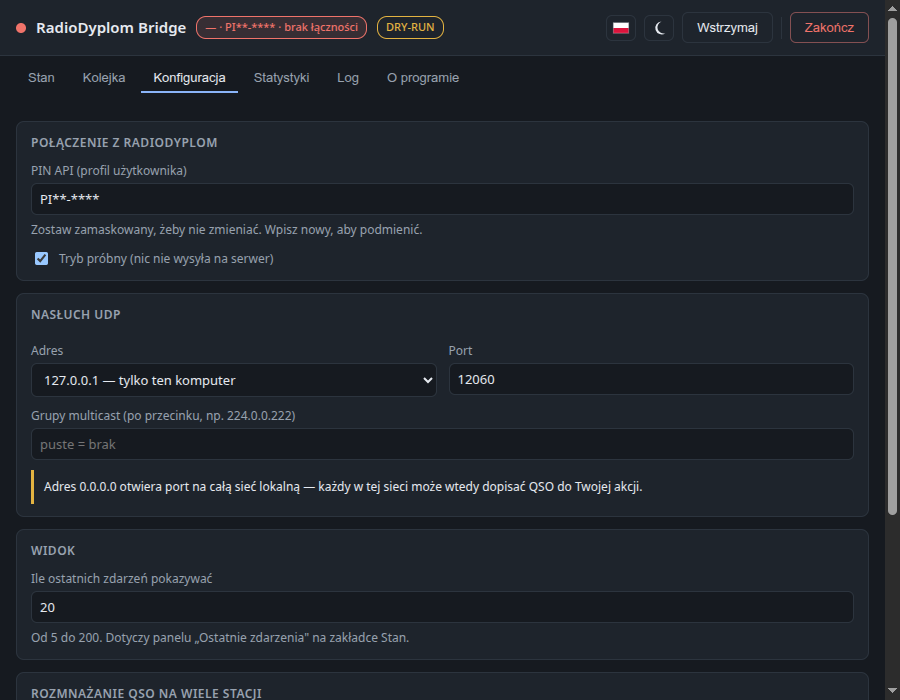

# Interfejs graficzny i API stanu

Okno aplikacji, praca w zasobniku, język oraz lokalne API dla podglądu stanu.

[← powrót do README](../README.md)


## Interfejs graficzny (Electron)

```bash
npm install      # electron jako zależność deweloperska
npm run ui
```

Aplikacja żyje **w zasobniku systemowym**. Zamknięcie okna ją tylko ukrywa —
mostek pracuje dalej.

**Aby zakończyć program, użyj przycisku „Zakończ" w oknie.** Menu pod ikoną
w zasobniku robi to samo, ale nie na każdym systemie jest dostępne (na Windows
potrafi się nie pokazywać), więc przycisk w oknie jest drogą pewną.

Ikona pokazuje stan bez otwierania okna:

| Kolor | Znaczenie |
|---|---|
| zielona | działa, łączność jest |
| **czerwona** | **brak łączności z radiodyplom** — QSO czekają w kolejce i będą dosłane automatycznie |
| żółta | wysyłka wstrzymana ręcznie, albo są QSO odrzucone (wymagają Twojej decyzji) |

Brak łączności rozpoznawany jest **dwiema drogami**, żeby nie umknął w żadnym scenariuszu:
- **cykliczny PING** (domyślnie co 60 s, `radiodyplom.pingIntervalMs`) — wykrywa problem
  także wtedy, gdy kolejka jest pusta i nic nie próbuje się wysłać;
- **realna próba wysyłki** — flaga `queue.online` gaśnie, gdy POST nie przeszedł
  z powodu sieci. To sygnał najwierniejszy, bo wynika z faktycznego żądania.

Błąd trwały (zły znak, brak uprawnień) **nie** gasi łączności — to problem z danymi,
nie z siecią, i dlatego daje stan żółty, a nie czerwony.

### Pytania zadaje własne okienko, nie natywne `confirm`

Wszystkie potwierdzenia (zapis mimo braku uprawnień, usunięcie PIN-u celu,
ponowienie w trybie próbnym, usunięcie odrzuconych, zakończenie programu)
rysuje **sama strona**. Escape i kliknięcie w tło anulują, ognisko wraca do pola,
z którego przyszło pytanie, a przyciski są przetłumaczone.

Powód nie jest kosmetyczny. Natywne, blokujące `window.confirm` w Electronie
na Linuksie po zamknięciu **nie oddawało ogniska klawiatury** rendererowi:
kliknięcia działały dalej, ale w żadnym polu nie dało się nic wpisać — okno
stawało się bezużyteczne. Odtworzone 2026-09-04 na ścieżce: dodaj cel bez
uprawnień → Zapisz → Anuluj → dopisz cokolwiek. Przywracanie ogniska z kodu
byłoby łataniem objawu, więc natywnych okienek nie używamy wcale.

### Karty liczbowe — co która liczy i za jaki czas

Każda karta ma drugą linię i podpowiedź pod kursorem, bo bez nich mieszały się
trzy różne rzeczy: licznik trwały z licznikiem procesu, kopie z QSO, oraz
wysyłka prawdziwa z próbną.

| Karta | Liczba główna | Druga linia |
|---|---|---|
| WYSŁANE | **kopie** wysłane od początku (trwałe) | `w tej sesji: N kopii`, plus duplikaty i przejścia próbne tej sesji, jeśli były |
| W KOLEJCE | oczekujące | `na dysku, przeżywa restart` |
| ODRZUCONE | odrzucone przez serwis | `na dysku, przeżywa restart` |
| ODEBRANE Z LOGGERA | **QSO** przyjęte w tej sesji | `datagramów: R · nieodczytane: N` |
| POMINIĘTE (DUPLIKATY) | deduplikacja | `w tej sesji` |

**Przejścia próbne nie wchodzą do „wysłanych"** — ani do licznika trwałego, ani
do sesyjnego. QSO, które nie opuściło komputera, nie jest wysłane. Liczba
przejść próbnych od początku jest w podpowiedzi karty.

Panel **ŹRÓDŁA** pokazuje pod dekoderami wiersz `bez QSO`, z podziałem na
nieznany format, brak wymaganych pól i świadome pominięcie — a pod nim
**wypisuje powody z liczbami**, na przykład:

```
bez QSO: 4  (nieznany format: 0 · brak wymaganych pól: 0 · pominięte świadomie: 4)
    operacja "update": 3
    operacja "delete": 1
```

Najczęstszy powód to **edycja albo usunięcie QSO w loggerze**: QLog wysyła
datagram przy każdej operacji w dzienniku, a mostek przekazuje wyłącznie
`insert` (`forward.operations`). Ponowne wysłanie poprawionego QSO i tak byłoby
duplikatem — radiodyplom nie ma czego „poprawiać".

**Uwaga na mnożnik:** licznik pokazuje **datagramy**, a jedna poprawka QSO
w QLogu wysyła ich **dwa** (zmierzone). Cztery pominięcia to więc dwie Twoje
edycje, nie cztery. Okno mówi o tym wprost pod listą powodów.

Powody są **zliczane, a nie logowane** na poziomie `info`: WSJT-X nadaje
komunikaty stanu co sekundę i zalałby log. Wcześniej trafiały tylko do `debug`,
więc przy domyślnych ustawieniach nie dało się odpowiedzieć na pytanie „skąd
te cztery pominięte".

### Powiadomienie o nowszej wersji

Program **nie aktualizuje się sam** — sprawdza tylko, czy na GitHubie jest
nowsze wydanie, i mówi o tym: odznaką w nagłówku (klik → zakładka „O programie")
oraz wierszem przy numerze wersji, z przyciskiem prowadzącym do wydania.

Dlaczego bez samoaktualizacji — trzy powody, w tej kolejności:

1. **Mostek pracuje w trakcie akcji.** Aktualizator, który się restartuje,
   przerywa nasłuch UDP, a QSO wysłane przez logger w tym oknie **nie ma jak
   wrócić** — UDP nie ponawia. Program gubiący łączności, żeby się
   zaktualizować, jest gorszy od nieaktualnego.
2. **Samoaktualizacja objęłaby dwie postacie z czterech.** `latest.yml`
   generowany przez electron-buildera opisuje wyłącznie instalator NSIS,
   a `latest-linux.yml` wyłącznie AppImage. `.deb` i wersja przenośna i tak
   potrzebowałyby powiadomienia — czyli tego, co jest.
3. Instalatorów nie podpisujemy, więc pobrana aktualizacja i tak trafiłaby na
   ostrzeżenie SmartScreen.

Sprawdzenie idzie do `api.github.com` na starcie i raz na dobę. **Da się je
wyłączyć** — to wychodzenie na zewnątrz, a nie każdy pracuje z łącza bez limitu:

```json
"updates": { "check": false }
```

Brak łączności jest **cichy**: żadnego czerwonego stanu, żadnego wpisu w logu
powyżej `debug`. Wpis pojawia się tylko wtedy, gdy nowsza wersja naprawdę jest.

### Panel „Konto na radiodyplom.pl"

Na zakładce **Stan**, z odpowiedzi `PING`. Pokazuje, czym konto naprawdę
dysponuje: operatora, **znaki stacji, na które wolno logować**, i **aktywne akcje**
z zakresem dat. To odpowiedź na najczęstsze „dlaczego moje QSO się nie zapisało":
albo znaku stacji nie ma na liście, albo żadna akcja w tej chwili nie trwa.

Rozróżnia dwa różne braki:

- *serwis nie podaje* — starsza wersja API, nic nie wiemy;
- *brak — konto nie ma przypisanej żadnej stacji* — serwis odpowiedział i wiemy,
  że nie ma nic.

### Znacznik uprawnień przy regule fan-outu

Każdy wiersz w „Rozmnażanie QSO na wiele stacji" ma znacznik, z podpowiedzią
pod kursorem:

| Znacznik | Znaczenie |
|---|---|
| zielone `✓` | konto ma tę stację na liście — kopie się zapiszą |
| żółta `•` | uprawnienia są, ale konto nie ma teraz aktywnej akcji |
| czerwone `!` | serwis kopii **nie przyjmie** (brak stacji, zły PIN, wyłączone API) |
| szare | to samo, ale reguła jest wyłączona — nic nie wysyła, więc nie jest pilne |
| brak | nie wiadomo: brak łączności, starszy serwis albo reguła dopiero wpisywana |

Znacznik jest **trwały** — nie gaśnie sam po chwili. Ostrzeżenie, które znika,
jest gorsze od żadnego.

Przy **zapisie** okno pyta, jeśli któraś włączona reguła nie przejdzie, i wymienia
stacje. **Zapisu nie blokuje**: dane bywają nieaktualne o minutę, serwis może nie
odpowiedzieć, a „wpiszę regułę teraz, stację dopiszę wieczorem" to normalna
kolejność pracy. Szczegóły w [konfiguracja.md](konfiguracja.md).

### Motyw: jasny, ciemny albo jak w systemie

**Przycisk z ikoną** w nagłówku, obok flagi języka. Klik przechodzi do
następnego z trzech stanów: **monitor** (jak w systemie) → **słońce** (jasny) →
**księżyc** (ciemny). Ikona pokazuje stan BIEŻĄCY, a podpowiedź mówi, co zrobi
klik — przy trzech stanach inaczej nie da się zgadnąć, czy ikona to stan
teraźniejszy, czy docelowy.

Domyślnie „jak w systemie", więc okno samo idzie za motywem pulpitu — i reaguje
na jego zmianę **w trakcie pracy**, bo przy tym wyborze nie ustawiamy nic na
dokumencie i decyduje `@media (prefers-color-scheme)`. Wybór jawny nadpisuje
system i zapamiętuje się w konfiguracji (`theme`), więc obowiązuje po restarcie
i w przeglądarce.



Trzy rzeczy warte odnotowania:

- **Paleta ciemna jest w CSS wypisana dwa razy** — raz dla wyboru jawnego
  (`[data-theme="dark"]`), raz dla pierwszego malowania strony, zanim renderer
  wczyta konfigurację. Bez tej drugiej kopii okno mrugałoby na biało przy
  każdym starcie na ciemnym systemie.
- **`nativeTheme` w Electronie** ustawiamy osobno. CSS nie sięga ramki okna,
  menu pod prawym przyciskiem ani pasków przewijania — bez tego ciemne okno
  miałoby jasne obramowanie. W przeglądarce nie ma czego ustawiać, więc
  odpowiednik metody nic nie robi.
- **Kolor tekstu na akcencie to zmienna** (`--on-accent`). W jasnym motywie
  akcent jest ciemnogranatowy i tekst na nim biały, w ciemnym akcent jest
  jasnoniebieski — biały tekst byłby na nim nieczytelny, więc jest prawie czarny.

- **Ikony są wbudowanymi SVG, nie emoji.** Flagi państw **nie renderują się
  jako flagi na Windowsie** — Segoe UI Emoji pokazuje wtedy litery „PL"/„GB",
  a Windows to główna platforma loggerów, więc przycisk wyglądałby inaczej
  u większości odbiorców. SVG wygląda identycznie wszędzie i nie dokłada
  żadnej zależności. Biały pas flagi polskiej dostaje obramowanie, inaczej
  ginąłby na jasnym tle nagłówka.

Lista dozwolonych wartości jest w rdzeniu **wypisana osobno** od tej
w `ui/strings.js`: pakiet bez interfejsu zawiera tylko `src/`, więc import
z `ui/` położyłby usługę na malince. Zgodność obu kopii pilnuje test.

### Panel „Poleci jako"

Odpowiada na jedno pytanie: **jakim znakiem stacji zostanie zapisane moje QSO.**
Dotąd ta informacja była wyłącznie w zakładce Konfiguracja, w tabeli celów —
czyli tam, gdzie zaglądasz, gdy coś zmieniasz, a nie gdy siadasz do pracy.

Pokazuje włączone cele wraz z operatorem i liczbę wyłączonych, a gdy nie ma
żadnego włączonego — wprost, że QSO poleci **ze znakiem z loggera**.

**Ostrzeżenie** pojawia się, gdy żaden włączony cel nie loguje na znak
przychodzący z loggera:

> UWAGA: logujesz jako SQ8BWM, a QSO poleci wyłącznie jako SN8N. Żaden włączony
> cel nie zapisuje na Twój znak z loggera.

To jest sytuacja, w której znak jest **poprawny**, serwer go przyjmie i nikt nie
zaprotestuje — a prywatna łączność trafia do dziennika akcji. Warunek jest
świadomie taki, a nie „znaki się różnią": przy rozmnażaniu QSO na kilka stacji
rozjazd jest normalny i zamierzony, więc ostrzeganie o nim **zawsze** zrobiłoby
z tego szum, który się ignoruje.

Ostrzeżenia nie ma, dopóki nie przyszło żadne QSO — bez datagramu nie ma z czym
porównywać, a ostrzeganie „na zapas" uczyłoby ignorowania tego panelu.

### Przycisk „Zrestartuj teraz"

Pojawia się **tylko wtedy**, gdy zapisane zmiany czekają na restart, w banerze,
który to zgłasza — a baner siedzi w przyklejonej części okna, więc widać go
także na dole długiej Konfiguracji, przy „Zapisz", i po przejściu na inną
zakładkę (rdzeń pamięta, co czeka).

**Dlaczego nie w nagłówku obok „Zakończ":** restart przerywa nasłuch UDP, a QSO
wysłane przez logger w tym okienku **nie ma jak wrócić** — to ten sam argument,
którym odrzuciliśmy samoaktualizację. Stały przycisk zapraszałby do kliknięcia
w trakcie akcji, i stałby ramię w ramię z „Zakończ". Dlatego jest też pytanie
z tym ostrzeżeniem.

Restart idzie **tą samą ścieżką co „Zakończ"**, żeby nie ominąć zamknięcia
kolejki, ikony w zasobniku i pliku logu. `app.relaunch()` wołane jest **przed**
zamknięciem, bo ono tylko planuje nowy proces.

**W przeglądarce przycisku nie ma** i to nie przeoczenie: usługa ma
`Restart=on-failure`, więc czyste wyjście by ją **zatrzymało**, nie podniosło.
Baner pokazuje tam polecenie `sudo systemctl restart radiodyplom-bridge`.

Na Windowsie mechanizm jest utwardzony pod dwa ryzyka (wersja portable
rozpakowana do katalogu tymczasowego, wyścig o blokadę jednej instancji), ale
**nietestowany na prawdziwej maszynie** — patrz BACKLOG.

### Zgłoszenie do wysłania

Zakładka *O programie* ma przycisk **Zapisz zgłoszenie do wysłania**, a menu
ikony w zasobniku pozycję *Zapisz zgłoszenie…*. Obie zapisują plik JSON obok
logu i pokazują go w menedżerze plików.

W menu zasobnika ta pozycja stoi **przed** „Pokaż plik konfiguracji" świadomie:
`config.json` zawiera jawny PIN, a jest pierwszą rzeczą, którą człowiek wysyła,
gdy coś nie działa. Łatwiejsza droga ma być bezpieczna — ostrzeżenie
w dokumentacji tego nie załatwia.

Szczegóły, co jest w środku: [konfiguracja.md](konfiguracja.md#zgłaszanie-błędów--czego-nie-wysyłać).

### Język
**Przycisk z flagą** w nagłówku okna — pokazuje język bieżący, klik przełącza na
drugi (są dwa, więc lista rozwijana byłaby na to za dużo). Wybór zapamiętywany w konfiguracji
(`language`), więc obowiązuje też dla menu i podpowiedzi w zasobniku oraz po restarcie.
Tłumaczenia siedzą w jednym słowniku `ui/strings.js` — bez żadnej biblioteki.

Komunikaty błędów z API przychodzą **po polsku z serwera**, dlatego przy angielskim
interfejsie tłumaczymy je **po kodzie** (`INVALID_CALLSIGN`, `NOT_SAVED`,
`INVALID_API_KEY`…), a treść serwera zostaje w nawiasie jako uzupełnienie.

Pięć zakładek:
- **Stan** — liczniki, adres nasłuchu, rozbicie na źródła (QLog / N1MM / WSJT-X)
  i **lista ostatnich zdarzeń**: co wysłane, co duplikat, co ponawiane, a co
  odrzucone. Wiersze z problemem są **czerwone**, ponowienia żółte, duplikaty
  wyblakłe. Ile wierszy pokazywać, ustawia się w Konfiguracji (5–200,
  domyślnie 20); bufor w rdzeniu trzyma 200, więc podniesienie liczby pokazuje
  historię od razu, a nie zaczyna zbierania od nowa.
- **Kolejka** — co czeka i co zostało odrzucone: znak, stacja, **operator**, liczba prób,
  powód. Operator jest tu istotny przy rozmnażaniu QSO: dwie kopie tej samej łączności
  różnią się stacją *i* operatorem, więc bez tej kolumny nie odróżnisz ich od siebie.
- **Konfiguracja** — PIN, tryb próbny, adres i port nasłuchu, grupy multicast,
  liczba pokazywanych zdarzeń, cele rozmnażania QSO.
- **Log** — bieżące zdarzenia. Pole zajmuje całą wysokość okna (liczoną
  z faktycznego położenia, więc zawinięcie nagłówka nic nie psuje) i przewija
  się **samo**, nie razem ze stroną. Widok skacze za nowymi wpisami tylko
  wtedy, gdy jest już na końcu logu; po przewinięciu w górę zostaje na miejscu,
  a pasek nad logiem mówi „przewinięte w górę" i pokazuje przycisk „Na koniec".
  Długie ładunki JSON są łamane, więc nie ma przewijania w bok.
- **O programie** — wersja, autor, licencja, **rodzaj instalacji** i zdanie
  o braku gwarancji, plus odnośniki do pełnego tekstu licencji, repozytorium
  i wydań.

**Wiersz „Instalacja"** mówi, skąd ten program został uruchomiony: *z
instalatora*, *portable* (z nazwą klikniętego pliku), *AppImage*, *paczka
.deb*, *usługa bez interfejsu* albo *ze źródeł*. Nie jest to ozdoba: na
Windowsie instalator i portable **dzielą ten sam katalog danych**
(`%APPDATA%\radiodyplom-bridge`), czyli tę samą konfigurację, ten sam PIN
i tę samą blokadę jednej instancji — więc po restarcie nie było jak
stwierdzić, który plik właściwie działa. Ten sam rodzaj (bez ścieżki) jedzie
w zgłoszeniu błędu, gdzie „portable" bywa całym wyjaśnieniem dziwnego
zachowania. Dopisek *„dane obok pliku programu"* znaczy, że ta instancja ma
własny katalog `radiodyplom-dane` — czyli własny PIN, własną kolejkę i własne
porty ([opis](konfiguracja.md#portable-i-appimage-dane-obok-pliku-programu)).

### Wąski ekran

Od 0.1.25 układ dostosowuje się do szerokości: przy ekranie węższym niż 620 px
liczniki idą po dwa w rzędzie, zakładki zostają w jednym rzędzie przewijanym
palcem, dwukolumnowe pary pól schodzą do jednej kolumny, a pola i przyciski
rosną pod palec. Tabele przewijają się w bok **wewnątrz** swoich paneli, więc
nagłówek nie ucieka razem z treścią.

Prawa krawędź paska zakładek jest **wygaszona** — to znak, że pasek się
przesuwa. Bez tego ostatnia zakładka wyglądała na uciętą i nic nie mówiło,
że da się do niej dojechać palcem. Rząd przycisków w nagłówku łamie się na
dwie linie, gdy trzeba: przy interfejsie wystawionym w sieć dochodzi ikona
kłódki i bez tego „Zakończ" wychodził za krawędź.

To ten sam plik `index.html`, który jedzie w oknie programu — więc te reguły
wchodzą też, gdy ktoś zwęzi okno na monitorze. Okno startuje w 900×700, czyli
domyślnie ich nie widać.

Do 0.1.24 strona nie miała `<meta viewport>` i przeglądarka na telefonie
rysowała ją tak, jakby ekran miał 980 px, a potem pomniejszała całość — dało
się z tego korzystać po powiększeniu palcami, ale niewygodnie.

### Gdy rdzeń nie wystartuje

Okno bez rdzenia nie ma czego pokazywać: stan, konfiguracja i statystyki idą
właśnie z niego. Dlatego przy nieudanym starcie okno pokazuje **czerwony baner
z powodem** i przycisk **Pokaż plik konfiguracji** — zakładka Konfiguracja jest
wtedy pusta, więc jedyną drogą naprawy jest plik. Do 0.1.21 powód siedział
wyłącznie w logu, a okno wyglądało na „jeszcze wstaje" — na zawsze.

Najczęstsza przyczyna to zajęty port UDP: druga instancja mostka albo inny
program. Wtedy trzeba zmienić `udp.port` (i `api.port`) w jednej z nich.

Zakładka „O programie" **nie ma niczego wpisanego na sztywno** — wersję, autora,
licencję i adres repozytorium bierze z `/api/status`, czyli z `package.json`.
Bez tego numer wersji w oknie rozjechałby się z nazwą pliku instalatora przy
pierwszym ręcznym podniesieniu wersji. Adres e-mail autora jest świadomie
pomijany: w oknie nie jest potrzebny, a w metadanych `.deb` i tak jest.

Odnośniki otwierają się w **przeglądarce systemowej**, przez IPC `openUrl`,
nie w oknie aplikacji. Uchwyt w procesie głównym przepuszcza wyłącznie adresy
`https://` — `shell.openExternal` wykonałby też `file:` czy `mailto:`.

### Tryb próbny a deduplikacja

W trybie próbnym wiersz zdarzenia mówi **„próbnie — NIE wysłane"**, a licznik
zmienia etykietę na **„Wysłane (próbnie)"**. Wcześniej pisał „wysłane" bez
numeru akcji, co przy QSO, które nigdy nie opuściło komputera, było zwykłym
kłamstwem.

Rzecz, o której trzeba wiedzieć: QSO przepuszczone próbnie zostaje **zamknięte
w deduplikacji** i **nie poleci** po wyłączeniu trybu próbnego. Tryb próbny
służy do sprawdzenia mapowania pól, nie do przechowywania QSO na później —
do tego jest przycisk **„Wstrzymaj"**, który trzyma je w kolejce. Podpowiedź
z tym ostrzeżeniem wisi na plakietce DRY-RUN.

### Sygnalizacja problemów

Gdy QSO **nie trafi na serwer** — odrzucone trwale albo porzucone po wyczerpaniu
prób — w nagłówku, obok plakietki DRY-RUN, zapala się czerwone **„PROBLEMY: n"**.

Rzecz istotna, bo pierwsza wersja robiła to **źle**: liczba nie jest licznikiem
w pamięci, a **różnicą** między zawartością `data/failed/` i trwale zapisanym
poziomem potwierdzenia (pole `ackedFailed` w `seen.json`).

Licznik w pamięci nie miał sensu: w spakowanej aplikacji rdzeń żyje w tym samym
procesie co okno, więc zamknięcie programu kasowało sygnalizację, choć odrzucone
QSO zostawały na dysku. Plakietka znikała, a problem trwał. Teraz przeżywa
restart — i potwierdzenie też.

Kliknięcie plakietki prowadzi na zakładkę **Kolejka**, gdzie stoją wszystkie
trzy przyciski: ponowienie, wyczyszczenie sygnalizacji i usunięcie odrzuconych
(patrz [Kolejka i log](kolejka.md)). Sama plakietka niczego nie kasuje —
w nagłówku obok stoi „Zakończ", więc nie może tam być akcji działającej
od jednego kliknięcia.

Poziom potwierdzenia jest przycinany w dół, gdy `failed/` się opróżni — po
„Ponów odrzucone" albo po ręcznym sprzątnięciu katalogu. Bez tego arytmetyka
przemilczałaby następne odrzucenie (potwierdzone 4, potem 1 nowe → 1−4 = 0).

Zwykłe ponowienia **nie** zapalają plakietki — naprawiają się same, a inaczej
świeciłaby przy każdym mignięciu sieci.

**PIN-y są w UI zawsze zamaskowane** (`ABCD-****`), także PIN-y celów fan-outu.
Pole zostawione zamaskowane oznacza „nie zmieniaj"; nowy PIN wpisuje się w całości.
Renderer nie ma dostępu do Node ani do rdzenia — wszystko idzie przez wąski most
IPC w `preload.cjs`.

### Co działa od razu, a co po restarcie
Od razu: PIN, tryb próbny, adres API, cele fan-outu i ich PIN-y, limity tempa,
poziom logowania, język.

Po restarcie: `udp.host`, `udp.port`, `udp.multicastGroups`, `api.port`, `api.enabled`,
`dataDir` i ścieżki kolejki — gniazdo UDP i kolejka są otwarte od startu procesu.

Zapis zwraca `restartRequired` (co właśnie wymaga restartu) oraz `pendingRestart`
(wszystko, co go jeszcze czeka). Dopóki lista nie jest pusta, nad zakładkami wisi
**trwały żółty banner**, a podpowiedź ikony w zasobniku dopisuje „wymaga restartu".

Banner jest sterowany stanem, nie odpowiedzią na zapis — jednorazowy komunikat
ginął przy przełączeniu zakładki, a wtedy zakładka Konfiguracja pokazywała nową
wartość, a Stan starą, bez niczego, co by je łączyło.

### Architektura UI
Electron **osadza rdzeń we własnym procesie** (`startDaemon`) i rozmawia z nim
bezpośrednio, bez HTTP. Serwer stanu zostaje włączony tylko po to, by dało się
podejrzeć mostek z przeglądarki lub skryptu.

Rdzeń nie wie o istnieniu UI. `npm start` uruchamia go bez Electrona — na
Raspberry Pi w shacku czy jako usługa systemd — i to jest zachowanie docelowe,
a nie tryb awaryjny.


## To samo okno w przeglądarce

> Nasłuch poza `127.0.0.1` jest możliwy od 0.1.15, ale wymaga hasła i HTTPS
> jednocześnie — patrz [interfejs-w-sieci.md](interfejs-w-sieci.md).


Pod adresem API (`http://127.0.0.1:12061/`) mostek oddaje **tę samą stronę**,
którą w Electronie rysuje okno. Te same pliki, inny sposób pokazania — most do
rdzenia buduje wtedy `ui/bridge-http.js` z żądań do `/api/*` zamiast z IPC.

Po co: na maszynie bez pulpitu (Raspberry Pi, serwer) to **jedyny interfejs
graficzny**, jaki jest — Electron wymaga środowiska graficznego, a dla 32-bitowego
ARM w ogóle nie istnieje (Electron buduje tylko `x64` i `arm64`). Bez tego
konfiguracja na malince to edycja JSON-a przez SSH.

Dostęp zdalny **wyłącznie tunelem SSH** — serwer nadal słucha tylko na
`127.0.0.1`. Szczegóły w [malinka.md](malinka.md).

Dwie rzeczy różnią się od okna na pulpicie, obie celowo:

- **nie ma przycisku „Zakończ"** — zamykanie usługi z karty przeglądarki to
  pułapka, a przypadkowe kliknięcie przerywa przekazywanie QSO;
- **nie ma „Pokaż plik logu"** — przeglądarka nie otworzy menedżera plików;
  log jest w zakładce Log.

Zakładkę można podać kotwicą (`/#stats`) i przeżywa odświeżenie strony.

## API stanu (dla UI)

Daemon wystawia lokalną powierzchnię stanu, z której korzysta interfejs użytkownika
(Electron albo zwykła przeglądarka). Włączona domyślnie:

```json
"api": { "enabled": true, "port": 12061 }
```

| Metoda | Ścieżka | Działanie |
|---|---|---|
| GET | `/api/status` | pełny stan: nasłuch, statystyki źródeł, kolejka, liczniki, ostatnie QSO i błąd |
| GET | `/api/log?n=50` | ostatnie zdarzenia z logu (bufor 300 wpisów) |
| POST | `/api/pause` | wstrzymuje **wysyłkę**; odbiór z loggera i kolejkowanie działają dalej |
| POST | `/api/resume` | wznawia wysyłkę |
| POST | `/api/requeue` | przywraca QSO z `failed/` do kolejki |
| GET | `/api/stats` | statystyki z dziennika wysłanych, z zakresem dat i zawężeniem po operatorze/stacji |
| POST | `/api/config/check` | ocenia cele z konfiguracji **niezapisanej** (ciało: taki sam obiekt jak przy zapisie) |

Dwie decyzje projektowe, świadome i celowe:

> **Serwer nasłuchuje wyłącznie na `127.0.0.1`** — niezależnie od `udp.host`. To jest
> interfejs *sterujący* wysyłką QSO na Twoim PIN-ie; wystawienie go na sieć oddałoby
> obcym kontrolę nad Twoim logiem.

> **PIN-y nigdy nie opuszczają procesu.** W `/api/status` są zamaskowane (`ABCD-****`),
> tak samo PIN-y celów fan-outu. UI nie potrzebuje ich w jawnej postaci.

> **Sprawdzanie nigdy nie zwraca piątki.** `/api/config/check` przy błędzie oddaje
> `200` z `ok:false` i pustą listą ocen. Gdyby padało błędem, okno musiałoby
> zgadywać, czy zapis wolno wykonać — a wolno **zawsze**.

Z cudzych kont `/api/status` podaje przy regule tylko `state`, `blocking` i znak
operatora — nigdy listy stacji. Listy stacji widać wyłącznie dla konta głównego,
w panelu „Konto na radiodyplom.pl".

Jeśli **port API** (12061) jest zajęty, daemon loguje ostrzeżenie i pracuje dalej —
brak podglądu nigdy nie może zatrzymać przekazywania QSO. Sprawdzone: przy zajętym
12061 QSO z loggera nadal przechodzi.

To dotyczy **wyłącznie portu API**. Port UDP, na którym słucha logger, to osobna
sprawa — patrz „Zajęty port UDP" niżej.

`queue.pending` / `queue.failed` / `queue.sent` to **liczniki**, a `pendingItems`
i `failedItems` to listy przycięte do 50 pozycji — nie myl ich przy budowie UI.
